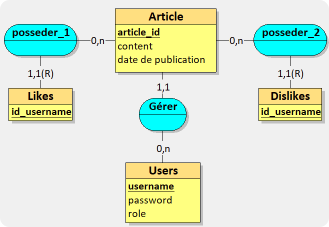
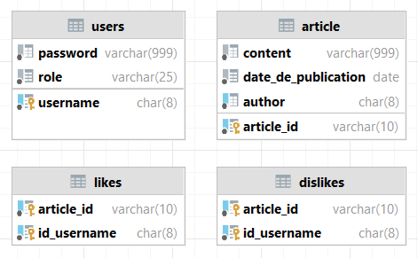

# ARTICLE MANAGER


## Description
**ARTICLE MANAGER** une API pour la gestion d'articles de blogs. Cette solution est orientée ressources, c’est-à-dire sur une API REST.


## Fonctionnalités
Il existe 3 fonctions principales :
* La publication, la consultation, la modification et la suppression des articles de blogs. 
  * Un article
  est caractérisé, a minima, par sa date de publication, son auteur et son contenu.
* L’authentification des utilisateurs souhaitant interagir avec les articles.
  * Cette fonctionnalité s'appuie sur les JSON Web Token (JWT). 
  * Un utilisateur est caractérisé par un nom d’utilisateur, un mot de passe et un rôle (moderator, publisher ou anonyme).
* La possibilité de liker/disliker un article.
    * Un utilisateur peut liker ou disliker un article. 
    * Un utilisateur ne peut liker qu’une seule fois un article. 
    * Un utilisateur ne peut disliker qu’une seule fois un article. 
    * Un utilisateur ne peut pas liker et disliker un article en même temps. 
    * Un utilisateur peut changer son opinion sur un article en likant ou dislikant à nouveau l’article.

## Restrictions d'accès

* **Publisher** : 
  * Peut consulter les articles avec les informations suivantes :
    * auteur
    * contenu
    * date de publication
    * nombre de likes/dislikes
  * Peut créer un article
  * Peut modifier/supprimer un article lui appartenant
  * Peut liker/disliker un article autre que le sien

* **Moderator** :
  * Peut consulter les articles
  * Peut supprimer un article
  * Peut supprimer/modifier un utilisateur
  * Peut obtenir la liste des utilisateurs
  * Peut obtenir des informations supplémentaires sur un article 
    * nombre de likes
    * nombre de dislikes
    * utilisateurs ayant liké/disliké l'article
* **Anonyme** :
    * Peut consulter les articles avec les informations suivantes :
      * auteur
      * contenu
      * date de publication

## Gestions des erreurs

* `200` : Succès de la requête
* `400` : Commande invalide
* `401` : Utilisateur non authentifié
* `403` : Accès refusé
* `404` : Donnée non trouvée

## TESTS

* **GET** `/articles` (all roles) : Récupère la liste des articles
````json
{
    "status": 200,
    "status_message": "All articles",
    "data": [
        {
            "author": "fujitoo",
            "content": "La conquête de la lune.",
            "date_de_publication": "2023-03-18"
        },
      "and more..."
    ]
}
````

**GET** `/articles/id=LAS428` (anonymous) : Récupère un article
````json
{
  "status": 200,
  "status_message": "[anonymous] L'article a ete recupere avec succes",
  "data": {
    "id": "LAS428",
    "author": "bonbily",
    "content": "Le monde d'hier.",
    "date_add": "2023-03-19"
  }
}
````
    
* **GET** `/articles/id=LAS428` (publisher) :
````json
{
    "status": 200,
    "status_message": "[yahyanft] L'article a ete recupere avec succes",
    "data": {
        "id": "LAS428",
        "author": "bonbily",
        "content": "Le monde d'hier.",
        "date_add": "2023-03-19",
        "likes_count": 1,
        "dislikes_count": 0
    }
}
````

* **GET** `/articles/id=LAS428` (moderator) :
````json
{
    "status": 200,
    "status_message": "[iutprof] L'article a ete recupere avec succes",
    "data": {
        "id": "LAS428",
        "author": "bonbily",
        "content": "Le monde d'hier.",
        "date_add": "2023-03-19",
        "likes_count": 1,
        "users_who_liked": [
            {
                "id_username": "yahyanft"
            }
        ],
        "dislikes_count": 0,
        "users_who_disliked": []
    }
}
````

* **POST** `/articles/id=LAS428` : *Créer - like - dislike* un article - créer un utilisateur
````json
{
    "status": 200,
    "status_message": "L'article a ete cree avec succes",
    "data": {
        "id": "LAS428",
        "author": "bonbily",
        "content": "Le monde d'hier.",
        "date_add": "2023-03-19"
    }
}
````

* **PUT** `/articles/id=LAS428` : Modifier un article/user 
````json
{
    "status": 200,
    "status_message": "L'article a ete modifie avec succes",
    "data": {
        "id": "LAS428",
        "author": "bonbily",
        "content": "Le monde d'hier.",
        "date_add": "2023-03-19"
    }
}
````

* **DELETE** `/articles/id=LAS428` : Supprimer un article - retirer like/dislike sur un article
````json
{
    "status": 200,
    "status_message": "L'article a ete supprime avec succes",
    "data": {
        "id": "LAS428",
        "author": "bonbily",
        "content": "Le monde d'hier.",
        "date_add": "2023-03-19"
    }
}
````

## Informations complémentaires

* Architecture de l'API :
  * **Modèle MVC** : Modèle, Vue, Contrôleur
  * **DAO** : Data Access Object
  * **Frontend** : `HTML`, `CSS`, `JS`
  * **Backend** : `PHP`, `MySQL`
  * **API** : `REST`
  * **Authentification** : JSON Web Token `JWT`
  * **Sécurité** : `XSS`, `CSRF`, `SQL Injection`


* **Modèle conceptuel de données** :



* **Modèle physique de données** :




# Crédits


Ce programme a été réalisé par des étudiants de l'**IUT informatique de Toulouse** dans le cadre d'un mini projet de groupe en programmation PHP. 
Pour en savoir un peu plus, vous pouvez contacter les développeurs de l'API
* [**Amdjad Anrifou**](https://github.com/maxiwere45)
* [**Carl Premi**](https://github.com/otsubyo)

### Professeurs de la ressource :
  * *Micheau Paul*
  * *Choquet Mathias*
  * *Broisin Julien*
